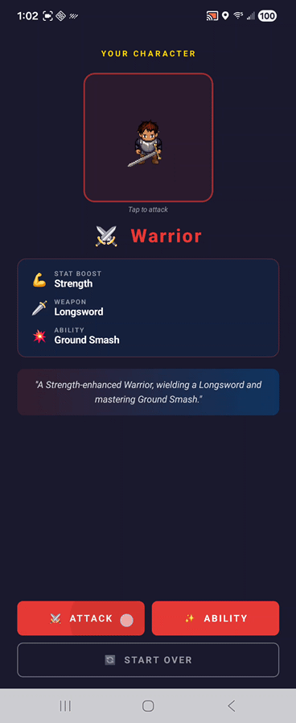

# Character Creator

Character Creator is a premium, multi-step character generation tool built with Jetpack Compose. It allows users to craft unique RPG characters by customizing physical attributes, selecting classes, and equipping class-specific weaponry.

The application features an advanced rendering engine that composites multiple sprite layers in real-time to create a seamless, animated character preview.

## App Walkthrough

<div align="center">
  
</div>

## Core Features

- **Deep Customization**: Personalize your character with multiple skin tones, hair styles, hair colors, eye colors, and ear types.
- **Class-Based System**: Choose from four distinct classes—**Warrior**, **Mage**, **Rogue**, and **Ranger**—each with its own visual theme and equipment.
- **Dynamic Equipment**: Weapons and abilities are class-specific, ranging from Arcane Staffs and Fireballs for Mages to Longswords and Juggernaut Charges for Warriors.
- **Animated Previews**: Real-time animated previews using composite LPC (Liberated Pixel Cup) sprite sheets.
- **Advanced Rendering Engine**:
    - **Layered Composition**: Renders characters by stacking layers (Body → Clothes → Hair → Armor → Weapon) in perfect synchronization.
    - **Custom Animations**: Supports class-specific combat animations including slashing, spellcasting, shooting, and thrusting.
    - **Visual Effects**: Includes special effects like shadow clones, dash offsets, and radial gradients for unique abilities.
- **Character Card**: A final summary screen displaying your character's full stats, description, and high-quality animated portrait.

## Technical Details

- **Language**: Kotlin
- **UI Framework**: Jetpack Compose
- **Navigation**: Compose Navigation for a seamless multi-screen flow.
- **Graphics**: Custom `Canvas` rendering for frame-accurate sprite animation and layering.
- **Concurrency**: Kotlin Coroutines for managing animation frames and state transitions.

## Project Structure

```text
com.codepath.charactercreator/
├── MainActivity.kt        # Entry point and Navigation Host
├── CharacterData.kt      # Data models, color palettes, and asset mappings
├── Sprite.kt             # Core rendering engine and animation logic
└── screens/              # UI screens for each step of the creation process
```

## Setup & Installation

1. Clone the repository.
2. Open the project in **Android Studio**.
3. Ensure you have the latest **Android SDK** and **Compose** dependencies installed.
4. Sync project with Gradle files.
5. Run the app on an emulator or physical device (API 24+ recommended).

## Credits

- Character assets based on the **Liberated Pixel Cup (LPC)** standard.
- Built as part of the Codepath Mobile Course.
